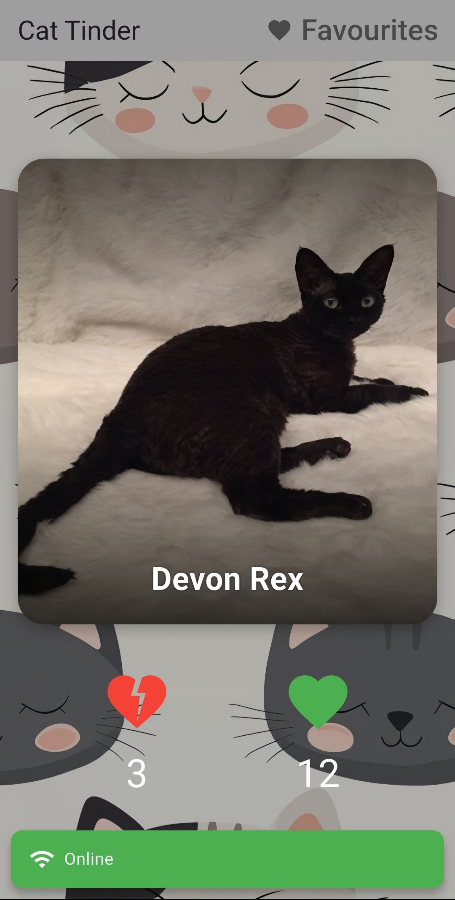
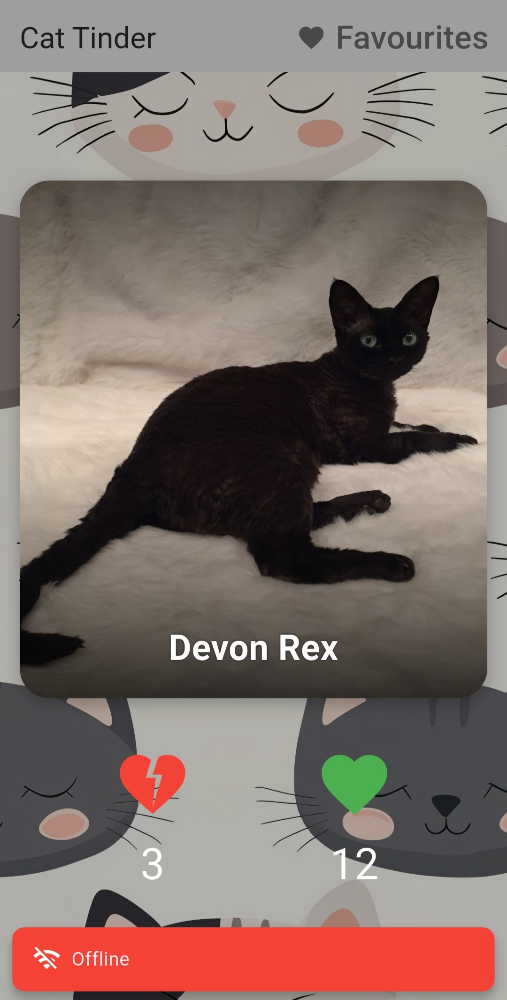

# LoveCats

Тиндер с котиками.  

Если вам нравиться котик, можете ознакомиться с более подробным описанием его породы,
нажав на изображение, а также поставить лайк или свайпнуть вправо.  

Если же по каким-то причинам котик вам не понравился, то можете поставить дизлайк или свайпнуть влево, 
чтобы увидеть ещё больше котиков.  

Понравившихся котиков можно посмотреть в отдельной вкладке, отфильтровать по породе или удалить, если котик разонравился.

Проект написан по архитектуре Data Domain Presentation, с использованием Cubit для управления состоянием.  

Добавлена работа с базой данных. Теперь сохраняется вся история просмотра, лайков и дизлайков.  

Также возможен оффлайн-режим работы с просмотром текущих лайков и их возможным удалением. Для понимания наличия сети сделан SnackBar.    

Помимо этого, в проекте осуществленно тестирование при помощи мока репозитория.

## Getting Started

`main.dart` - входная точка проекта.  
`domain.model` - основные модели (cat, liked_cat).   
`domain.repository` - методы работы с данными.  
`presentation.cubit` - управление состоянием.  
`presentation.page` - страницы приложения.  
`utils` - логгер и локатор служб.  
`database.dart` - настроцка БД.  

## Screenshots

## Apk

https://drive.google.com/file/d/1bA37TSf-9h3IlznrvRCHDD1iLstkga1x/view?usp=sharing