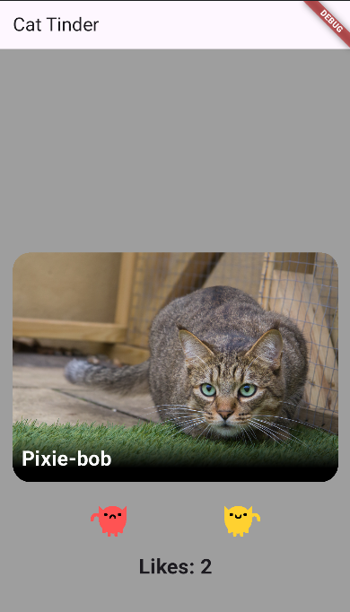
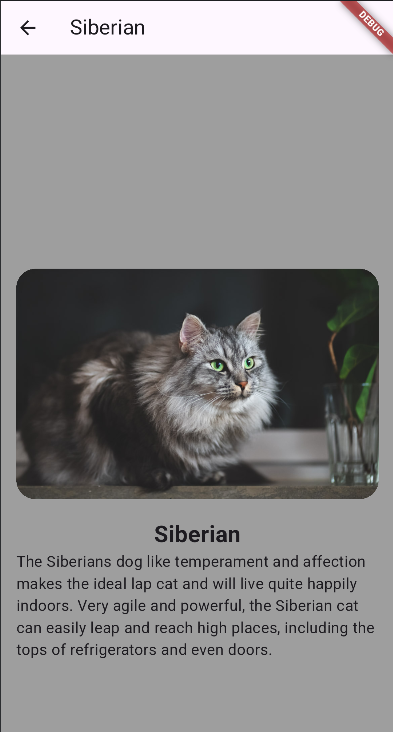
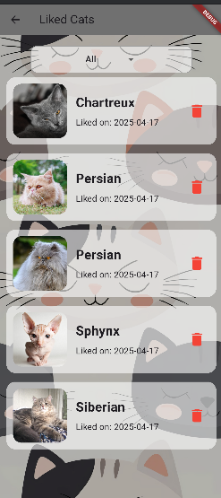
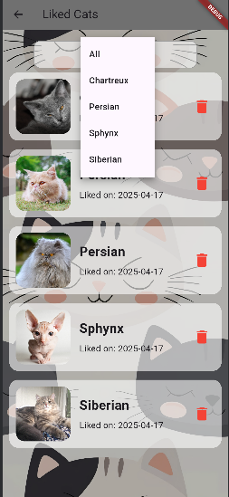
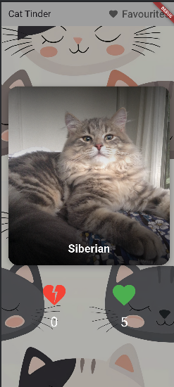

# LoveCats

Тиндер с котиками.  

Если вам нравиться котик, можете ознакомиться с более подробным описанием его породы,
нажав на изображение, а также поставить лайк или свайпнуть вправо.  

Если же по каким-то причинам котик вам не понравился, то можете поставить дизлайк или свайпнуть влево, 
чтобы увидеть ещё больше котиков.  

Понравившихся котиков можно посмотреть в отдельной вкладке, отфильтровать по породе или удалить, если котик разонравился.

Проект написан по архитектуре Data Domain Presentation, с использованием Cubit для управления состоянием.

## Getting Started

`main.dart` - основной файл проекта, в нём прописана вся основная логика.

## Screenshots

## Apk

https://drive.google.com/file/d/1bA37TSf-9h3IlznrvRCHDD1iLstkga1x/view?usp=sharing